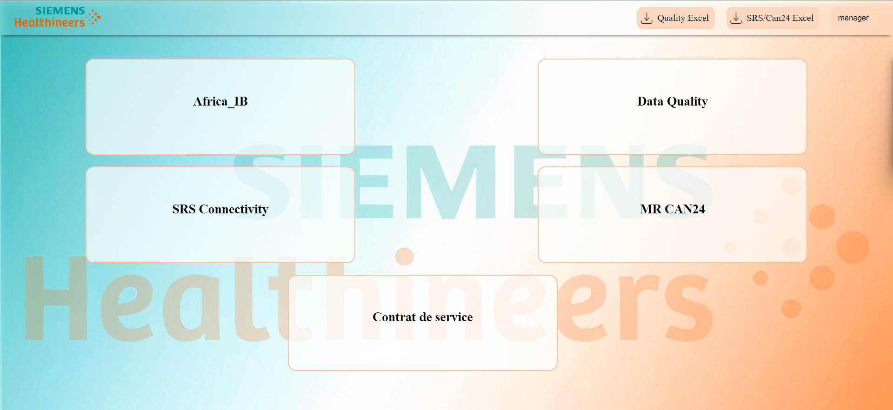
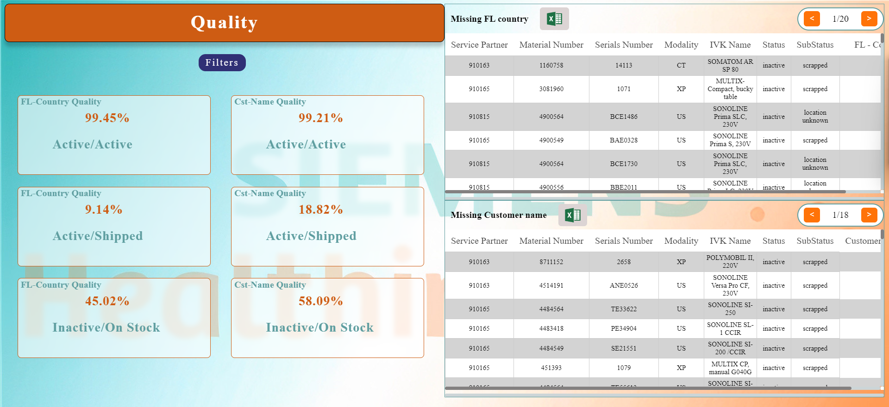
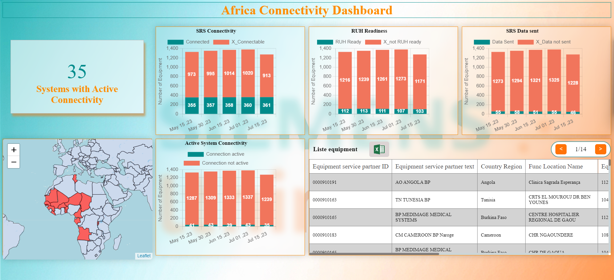
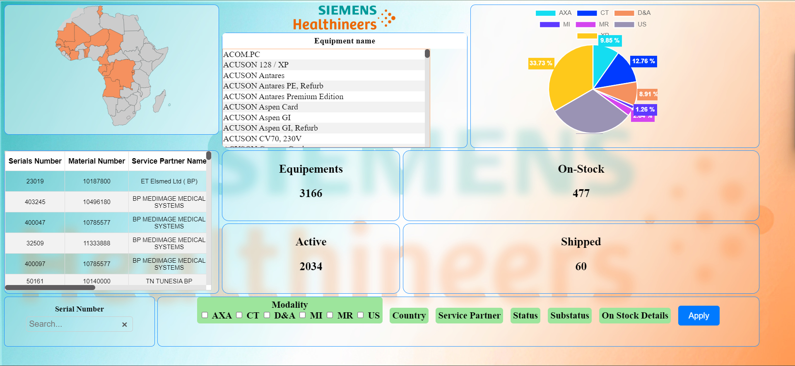
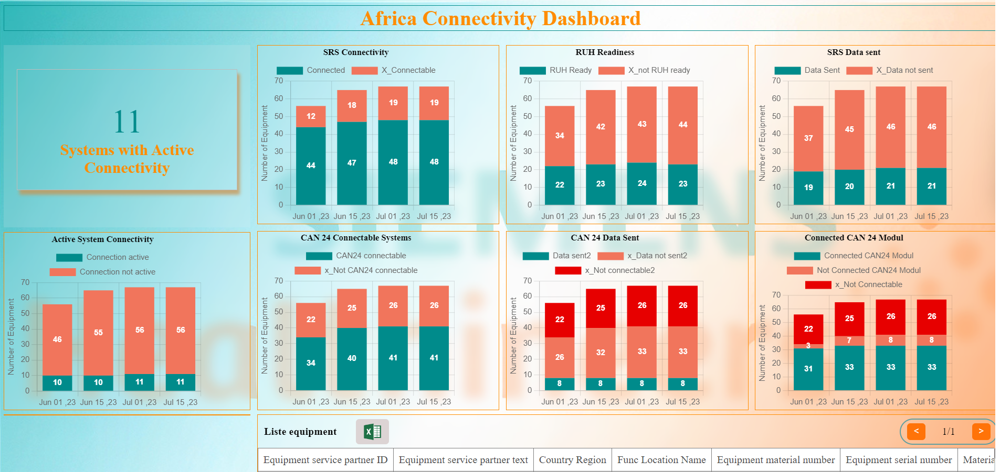
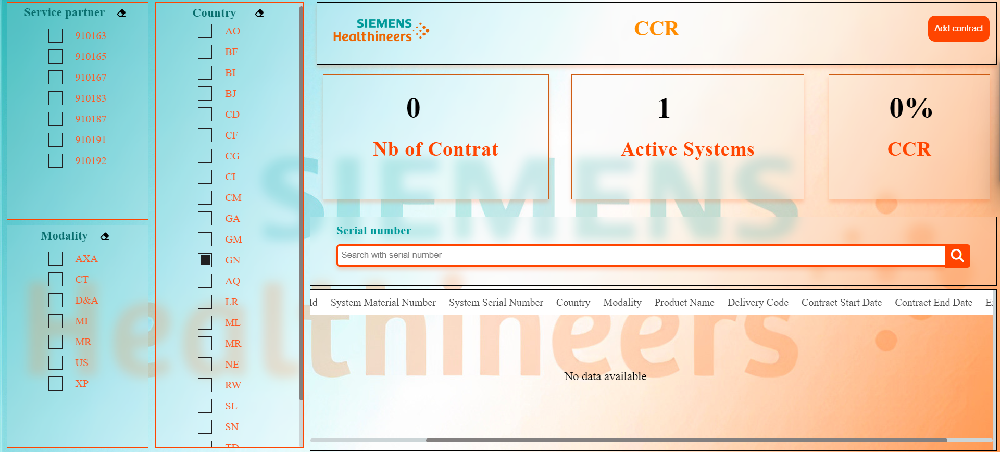
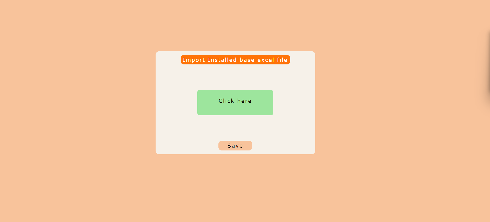
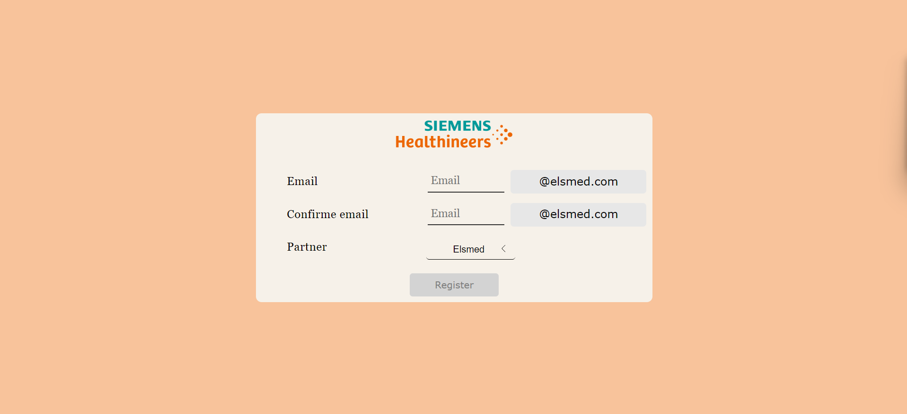
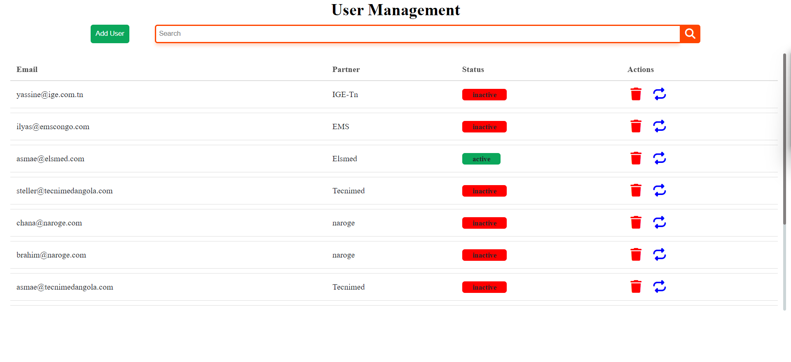

# Data management system for health company

## Introduction

This project is a data management system for a health company. It is a web application that allows managers and assistantes to manage the data of the company, it also allows the partners to manage their own data.

We have used Django as a framework for the backend and Html, CSS and Javascript for the frontend. to handle charts we have used Chart.js and for maps we have used Leaflet.js and openstreetmap. for the database we have used PostgreSQL.

## Installation

### Requirements

- Python 3.10
- PostgreSQL
- venv

### Steps

1. Clone the repository
2. Create a virtual environment
3. Install the requirements
4. Create user and database in PostgreSQL
5. Create a .env file
6. Run the migrations
7. Create a superuser
8. Run the server

#### 1. Clone the repository

```bash
git clone
```

#### 2. Create a virtual environment

```bash
python -m venv venv
```

#### 3. Install the requirements

```bash
pip install -r requirements.txt
```

#### 4. Create a database

first you need to connect to the posgresql user using the command:

```bash
psql -U postgres
```

than you need to create a user and a database using the following commands:

```postgresql
create user sysmanuser with password 'root';
create database sysmandb owner sysmanuser;
```

#### 5. Create a .env file

create a .env file in the root of the project and add the following variables:

```bash
SECRET_KEY=your_secret_key
DB_NAME=your_db_name
DB_USER=your_db_user
DB_PASSWORD=your_db_password
```

#### 6. Run the migrations

```bash
python manage.py migrate
```

#### 7. Create a superuser

create a superuser that will be used to login to the admin panel using the following command:

```bash
python manage.py createsuperuser
```

#### 8. Run the server

```bash
python manage.py runserver
```

## Usage

### Login


### Home



### Data Quality



### SRS Connectivity



### Africa_IB



### MR CAN24



### Service Contract



### Import file



### Add partner



### Manage partners



## Contributors

<a href="https://github.com/yassine-san/Siemens_pg/graphs/contributors">
  
</a>

## License

[MIT](https://choosealicense.com/licenses/mit/)

## Acknowledgements

- [Django](https://www.djangoproject.com/)
- [Chart.js](https://www.chartjs.org/)
- [Leaflet.js](https://leafletjs.com/)
- [OpenStreetMap](https://www.openstreetmap.org/)
